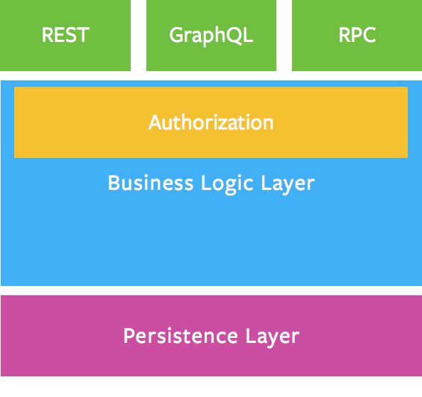

# Thinking in Graphs

**It's Graphs All the Way Down.**

> With GraphQL, you model your business domain as a graph
> Với GraphQL, bạn lập business model của mình dưới dạng graph.

Graphs (biểu đồ) là công cụ mạnh mẽ để mô hình hóa nhiều hiện tượng trong thế giới thực vì chúng giống với mô hình tự nhiên và mô tả bằng lời về quy trình cơ bản. Với GraphQL, bạn lập mô hình business domain của mình dưới dạng biểu đồ bằng cách xác định một lược đồ (schema); trong lược đồ, bạn define các node và cách chúng kết nối(connect)/liên quan (relate) với nhau. Trên client, điều này tạo ra một pattern tương tự như Lập trình hướng đối tượng: kiểu này tham chiếu đến các kiểu khác. Trên server, vì GraphQL chỉ define  interface nên bạn có quyền tự do sử dụng nó với bất kỳ chương trình phụ trợ nào (mới hoặc cũ!).

## Shared Language

> Naming things is a hard but important part of building intuitive APIs
> Đặt tên là 1 phần khó nhưng qua trọng trong việc xây dựng APIs

Hãy suy nghĩ GraphQL schema như một ngôn ngữ chia sẻ cho nhóm và người dùng của bạn. Để xây dựng một schema tốt, hãy sử dụng ngôn ngữ hàng ngày bạn sử dụng để mô tả business. Ví dụ: hãy thử mô tả một ứng dụng email bằng tiếng Anh đơn giản:

- 1 user có thể có nhiều email account.
- Mỗi email account có 1 address, inbox, drafts, deleted items và sent items.
- Mỗi email có 1 sender, receive date, subject và body
- Users không thể send email mà không có 1 `recipient address`.

Đặt tên là 1 phần khó nhưng qua trọng trong việc xây dựng APIs, vì vậy, hãy dành thời gian suy nghĩ cẩn thận xem điều gì có ý nghĩa đối với business domain và user. Nhóm của bạn nên có sự hiểu biết chung và sự đồng thuận về các quy tắc business domain này vì bạn sẽ cần chọn những tên có tính trực quan, lâu bền cho các node và các quan hệ trong GraphQL schema. Hãy thử tưởng tượng một số query mà bạn muốn thực hiện:

Lấy số lượng unread email trong index cho tất cả các account.

```
{
  accounts {
    inbox {
      unreadEmailCount
    }
  }
}
```

Lấy `preview info` cho 20 drafts ddaauf tieen trong main account.

```
{
  mainAccount {
    drafts(first: 20) {
      ...previewInfo
    }
  }
}
 
fragment previewInfo on Email {
  subject
  bodyPreviewSentence
}
```

## Business Logic Layer

> Your business logic layer should act as the single source of truth for enforcing business domain rules
> Business logic layer nên hoạt động như 1 nguồn duy nhất để thực thi các rule của business domain.

Nên xác định business logic thực tế ở chỗ nào? Nên thực hiện validation và authorization ở đâu? Câu trả lời: bên trong một business logic layer chuyên dụng. Business logic layer nên hoạt động như 1 nguồn duy nhất để thực thi các rule của business domain.



Trong sơ đồ trên, tất cả các end points (REST, GraphQL và RPC) vào hệ thống sẽ được xử lý với cùng một quy tắc validation, authorization và error handling.

## Working with Legacy Data

> Prefer building a GraphQL schema that describes how clients use the data, rather than mirroring the legacy database schema.
> Sẽ vui hơn khi xây dựng 1 GraphQL schema mô tả được cách thức mà client sử dụng data, hơn là copy y hệt database schema.

Đôi khi, bạn sẽ làm việc với các nguồn dữ liệu cũ không phản ánh hoàn hảo cách client sử dụng dữ liệu. Trong những trường hợp này, chúng ta nên tạo một GraphQL schema mô tả cách client sử dụng dữ liệu hơn là sao chép database schema.

Xây dựng GraphQL schema để biểu thị `how` hơn là `what`. Tiếp đến có thể cải thiện chi tiết implemetation mà không phá vỡ các interface đối với các client cũ.

## One Step at a time

> Get validation and feedback more frequently

Đừng cố gắng model hóa toàn bộ business model trong một lần. Thay vào đó, chỉ xây dựng một phần của schema mà bạn cần cho một kịch bản tại một thời điểm. Bằng cách dần dần mở rộng schema, bạn sẽ nhận được validation và feedback thường xuyên hơn để hướng bạn đến việc xây dựng giải pháp phù hợp.